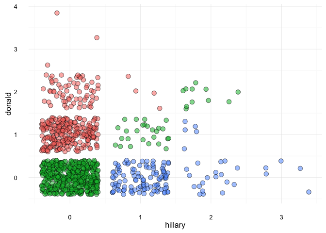

Retrieving Tweets via Twitter's Search and Stream APIs
================

``` r
#devtools::install_github("mkearney/rtweet")
library(rtweet)
```

Search tweets
-------------

``` r
srch_df <- search_tweets(q = "election", count = 1000, type = "recent", lang = "en")
```

    ## Searching for tweets...

    ## Collected 1000 tweets!

``` r
srch_df
```

    ## # A tibble: 1,000 x 26
    ##             created_at          status_id retweet_count favorite_count
    ##                 <time>              <chr>         <int>          <int>
    ## 1  2016-08-08 21:02:28 762831381084770304            51              0
    ## 2  2016-08-08 21:02:28 762831380950638592             6              0
    ## 3  2016-08-08 21:02:28 762831379654598656            15              0
    ## 4  2016-08-08 21:02:27 762831378291580930             0              0
    ## 5  2016-08-08 21:02:27 762831374453706752             0              0
    ## 6  2016-08-08 21:02:26 762831371349786624             2              0
    ## 7  2016-08-08 21:02:24 762831365519863808          1045              0
    ## 8  2016-08-08 21:02:24 762831362369826817            34              0
    ## 9  2016-08-08 21:02:24 762831361786810369            76              0
    ## 10 2016-08-08 21:02:23 762831358922227713            51              0
    ## # ... with 990 more rows, and 22 more variables: text <chr>,
    ## #   in_reply_to_status_id <chr>, in_reply_to_user_id <chr>,
    ## #   is_quote_status <lgl>, quoted_status_id <chr>, lang <chr>,
    ## #   user_id <chr>, user_mentions <list>, hashtags <list>, urls <list>,
    ## #   is_retweet <lgl>, retweet_status_id <chr>, place_name <chr>,
    ## #   country <chr>, long1 <dbl>, long2 <dbl>, long3 <dbl>, long4 <dbl>,
    ## #   lat1 <dbl>, lat2 <dbl>, lat3 <dbl>, lat4 <dbl>

### Analyze text of Tweets

``` r
wrds <- clean_tweets(srch_df, min = 2, exclude_words = "election")
wrds[1:3]
```

    ## [[1]]
    ## [1] "reminder"    "republicans" "steal"       "courts"      "stopped"    
    ## [6] "mopiyxxqi"  
    ## 
    ## [[2]]
    ## [1] "minneapolis"  "women"        "lining"       "vote"        
    ## [5] "time"         "presidential" "sgirdyr"     
    ## 
    ## [[3]]
    ## [1] "justcanttrust" "security"      "neverhillary"

``` r
srch_df$text[1:3]
```

    ## [1] "RT @BarbByrum: REMINDER: Republicans were trying to steal this election and the courts stopped them https://t.co/MoPiy5xxQi via @Eclectablog"    
    ## [2] "RT @oldpicsarchive: Minneapolis women lining up to vote for the first time in a presidential election, 1920 https://t.co/s2Gird3yR0 https:/…"    
    ## [3] "RT @ThomasBernpaine: #JustCantTrust Moving election data to Homeland \"Security\" #PaperBallots\n\n#FeelTheBern #NeverHillary https://t.co/WxZd…"

``` r
srch_df$hillary <- sapply(srch_df$user_mentions, function(x) sum(grepl("1339835893", unlist(x)), na.rm = TRUE)) + 
  sapply(wrds, function(x) sum(grepl("hillary|clinton", unlist(x)), na.rm = TRUE))

srch_df$donald <- sapply(srch_df$user_mentions, function(x) sum(grepl("25073877", unlist(x)), na.rm = TRUE)) + 
  sapply(wrds, function(x) sum(grepl("donald|trump", unlist(x)), na.rm = TRUE))

srch_df$withher <- as.numeric(srch_df$hillary > srch_df$donald)
srch_df$withher <- srch_df$withher - as.numeric(srch_df$hillary < srch_df$donald)
library(ggplot2)
theme_set(theme_minimal())
ggplot(srch_df, aes(x = hillary, y = donald, fill = factor(withher), alpha = .9)) + 
  geom_jitter(size = 3, shape = 21) + 
  theme(legend.position = "none")
```


